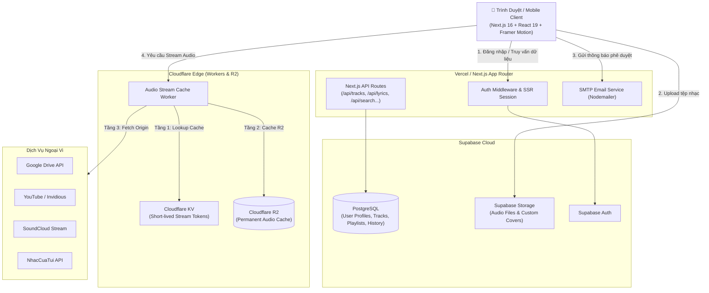

<div align="center">

# 🎵 MusicWeb — Nền Tảng Nghe Nhạc Trực Tuyến Đa Nguồn & Cá Nhân Hóa

Một ứng dụng web nghe nhạc hiện đại, mượt mà được xây dựng trên **Next.js 16 (App Router)**, **React 19**, **Supabase**, **Cloudflare Workers** và **Three.js**. Hỗ trợ phát nhạc từ nhiều nguồn (Local Upload, Google Drive, YouTube, SoundCloud, NhacCuaTui), đồng bộ lời bài hát thời gian thực, giao diện Glassmorphism cao cấp cùng hệ thống hiệu ứng & con trỏ chuột độc đáo.

[](https://nextjs.org/)
[](https://react.dev/)
[](https://www.typescriptlang.org/)
[](https://tailwindcss.com/)
[](https://supabase.com/)
[](https://workers.cloudflare.com/)
[](https://threejs.org/)
[](LICENSE)

</div>

---

## 🌟 Điểm Nổi Bật (Key Features)

### 🎧 1. Phát Nhạc Đa Nguồn (Multi-Source Streaming)
* **Kho Nhạc Cá Nhân (Local Upload):** Tải lên các tệp âm thanh (`.mp3`, `.wav`, `.m4a`, `.flac`) trực tiếp lên Supabase Storage. Tự động trích xuất metadata (tên bài hát, nghệ sĩ, album, ảnh bìa ID3, thời lượng) ngay tại trình duyệt với `music-metadata-browser`.
* **Google Drive Streaming & Import:** Phát trực tiếp từ Google Drive hoặc nhập cả thư mục nhạc mà không lo giới hạn băng thông nhờ cơ chế stream qua Cloudflare R2 cache.
* **Tích Hợp YouTube & SoundCloud:** Tìm kiếm và phát trực tiếp âm thanh chất lượng cao từ YouTube (hỗ trợ Invidious fallback) và SoundCloud.
* **Tích Hợp NhacCuaTui (NCT):** Tự động tìm kiếm, đồng bộ thông tin bài hát và phát nhạc với cơ chế Fallback thông minh.

### 🎨 2. Giao Diện Hiện Đại & Trải Nghiệm Mượt Mà (UI/UX)
* **Phong Cách Glassmorphism & Liquid Ambient:** Lấy cảm hứng từ Spotify và Apple Music với nền hiệu ứng phát sáng động theo màu ảnh bìa bài hát.
* **Mobile Fullview Player:** Trình phát toàn màn hình trên điện thoại với cử chỉ vuốt mượt mà (Swipe-to-dismiss), hiệu ứng phóng to ảnh đĩa nhạc và thanh điều khiển tối ưu.
* **Visualizer & Waveform Scrubber:** Thanh tua nhạc dạng sóng âm thanh trực quan, mini equalizer và sân khấu đồ họa 3D hiệu ứng hạt (Three.js / React Three Fiber).
* **Con Trỏ Chuột Tùy Biến (Custom Cursors):** Bộ sưu tập con trỏ chuột hoạt họa và tĩnh độc đáo (Anime, Gaming), có kèm CLI script để thêm nhân vật mới dễ dàng.
* **Chủ Đề Phong Phú (Themes):** Chuyển đổi giao diện linh hoạt (Summer, Cyberpunk, Gaming Mode, Neon...).

### 📜 3. Tính Năng Nghe Nhạc & Cá Nhân Hóa Toàn Diện
* **Lời Bài Hát Đồng Bộ (Real-time Synced Lyrics):** Hiển thị lời bài hát cuộn mượt theo thời gian thực (định dạng LRC), hỗ trợ chế độ Karaoke và tạo ảnh chia sẻ trích dẫn lời bài hát (Lyrics Share Card).
* **Hóa Đơn Âm Nhạc (Receiptify / Music Receipt):** Tự động tổng hợp và in "biên lai hóa đơn" thống kê top bài hát, nghệ sĩ và thời lượng nghe nhạc của bạn.
* **Quản Lý Danh Phát (Playlists & Favorites):** Tạo, đổi tên, sắp xếp và chia sẻ playlist qua liên kết/mã chia sẻ; quản lý danh sách yêu thích và lịch sử nghe nhạc.
* **Hàng Đợi & Điều Khiển Nâng Cao:** Quản lý danh sách phát tiếp theo (Queue Drawer), chế độ phát ngẫu nhiên (Shuffle), lặp lại (Repeat One/All), và chuyển bài mượt mà.

### 🔒 4. Bảo Mật & Hệ Thống Quản Trị
* **Supabase Auth & RLS:** Xác thực an toàn với cơ chế phân quyền Row Level Security (RLS) bảo vệ quyền riêng tư tuyệt đối cho từng người dùng.
* **Admin Approval Workflow:** Hệ thống gửi thông báo phê duyệt tài khoản mới hoặc yêu cầu Passkey qua SMTP Email (Nodemailer) tới Admin.

---

## 🏗 Kiến Trúc Hệ Thống (System Architecture)



---

## 🛠 Công Nghệ Sử Dụng (Tech Stack)

| Lớp (Layer) | Công nghệ | Mục đích |
|---|---|---|
| **Frontend Framework** | [Next.js 16 (App Router)](https://nextjs.org/) + [React 19](https://react.dev/) | SSR, Server Components, Streaming UI |
| **Ngôn Ngữ** | [TypeScript 5](https://www.typescriptlang.org/) | Type-safety tuyệt đối cho toàn bộ dự án |
| **Styling & Icons** | [Tailwind CSS v4](https://tailwindcss.com/), [Lucide React](https://lucide.dev/) | Hệ thống giao diện hiện đại, responsive, icon tối giản |
| **Hiệu Ứng & 3D** | [Framer Motion](https://www.framer.com/motion/), [Three.js](https://threejs.org/), `@react-three/fiber`, Lottie | Animation mượt mà, Visualizer 3D |
| **Cơ Sở Dữ Liệu & Auth** | [Supabase (PostgreSQL)](https://supabase.com/) | Quản lý bảng dữ liệu, Row Level Security (RLS) |
| **Lưu Trữ File** | Supabase Storage & Cloudflare R2 | Lưu trữ bài hát upload và cache streaming |
| **Edge Cache & Proxy** | [Cloudflare Workers](https://workers.cloudflare.com/) + KV | Tối ưu hóa độ trễ phát nhạc và bypass rate limit |
| **Xử Lý Âm Thanh** | `music-metadata-browser`, `@breezystack/lamejs`, Web Audio API | Đọc thẻ ID3/Cover Art, chuyển đổi MP3 client-side |
| **Email & Notifications** | [Nodemailer](https://nodemailer.com/) | Gửi email phê duyệt đăng ký & mã passkey |
| **Kiểm Thử** | [Vitest](https://vitest.dev/) | Unit testing & component testing |

---

## 📂 Cấu Trúc Thư Mục (Project Structure)

```plaintext
MusicWeb/
├── app/                          # Next.js App Router
│   ├── (app)/                    # Route nhóm ứng dụng chính (có Sidebar & PlayerBar)
│   │   ├── album/ & albums/      # Trang chi tiết & danh sách album
│   │   ├── artist/               # Trang nghệ sĩ
│   │   ├── drive/                # Trình quản lý & nhập file từ Google Drive
│   │   ├── favorites/            # Danh sách bài hát yêu thích
│   │   ├── history/              # Lịch sử nghe nhạc
│   │   ├── lyrics/               # Trình xem lời bài hát toàn màn hình
│   │   ├── playlist/             # Chi tiết & tạo danh sách phát
│   │   ├── receipt/              # Trình tạo biên lai âm nhạc (Receiptify)
│   │   ├── settings/             # Cài đặt cá nhân & tài khoản
│   │   ├── soundcloud/           # Khám phá nhạc từ SoundCloud
│   │   ├── upload/               # Trang tải nhạc lên
│   │   └── page.tsx              # Trang chủ / Khám phá
│   ├── api/                      # Next.js Serverless API routes
│   │   ├── auth/ & register/     # API xác thực người dùng
│   │   ├── drive-stream/         # API resolve & stream Google Drive
│   │   ├── lyrics/               # API tìm kiếm và trích xuất lyrics
│   │   ├── youtube/ & soundcloud/# API proxy & stream nhạc ngoại vi
│   │   └── ...
│   ├── login/ & register/        # Trang đăng nhập & đăng ký
│   └── globals.css               # Định nghĩa token CSS, Glassmorphism & Themes
├── components/                   # React Components tái sử dụng
│   ├── auth/                     # Form xác thực, phê duyệt email
│   ├── common/                   # Modal, button, input dùng chung
│   ├── navigation/               # Topbar, header điều hướng
│   ├── player/                   # Trình phát nhạc (PlayerBar, Fullview, Visualizer, Scrubber)
│   ├── playlist/                 # Thẻ playlist, danh sách bài hát
│   ├── sidebar/                  # Sidebar điều hướng desktop
│   ├── theme/                    # Trình chọn theme & Custom Cursor
│   └── track/                    # Danh sách và dòng bài hát (TrackRow, TrackCard)
├── lib/                          # Tiện ích, client Supabase, helper functions
├── public/                       # Assets tĩnh (icon, cursor, lottie, logo)
├── scripts/                      # CLI Scripts (add-cursor.js, auth helpers)
├── supabase/                     # Schema SQL, migration & RLS policies
├── workers/ & worker/            # Cloudflare Workers mã nguồn (R2 Stream Cache)
├── vitest.config.ts              # Cấu hình kiểm thử Vitest
└── package.json                  # Dependencies & scripts
```

---

## 🚀 Hướng Dẫn Cài Đặt & Chạy Cục Bộ (Getting Started)

### 1. Yêu Cầu Tiên Quyết
* **Node.js**: Phiên bản `18.x` hoặc `20.x` trở lên
* **Trình quản lý gói**: `npm`, `yarn`, `pnpm` hoặc `bun`
* **Tài khoản Supabase**: Tạo project miễn phí tại [supabase.com](https://supabase.com/)

### 2. Clone Repository & Cài Đặt Dependencies

```bash
git clone https://github.com/PhongTCT/MusicWeb.git
cd MusicWeb

# Cài đặt các gói phụ thuộc
npm install
```

### 3. Cấu Hình Biến Môi Trường (`.env.local`)

Tạo tệp `.env.local` tại thư mục gốc của dự án và điền các thông tin:

```env
# ==============================================================================
# SUPABASE CONFIGURATION
# ==============================================================================
NEXT_PUBLIC_SUPABASE_URL=https://your-project-id.supabase.co
NEXT_PUBLIC_SUPABASE_ANON_KEY=your-supabase-anon-key
NEXT_PUBLIC_SUPABASE_PUBLISHABLE_KEY=your-supabase-publishable-key
SUPABASE_SERVICE_ROLE_KEY=your-supabase-service-role-key

# ==============================================================================
# SMTP EMAIL CONFIGURATION (Dùng cho thông báo Admin & Passkey)
# ==============================================================================
SMTP_HOST=smtp.gmail.com
SMTP_PORT=587
SMTP_USER=your-email@gmail.com
SMTP_PASS=your-gmail-app-password
ADMIN_PERSONAL_EMAIL=admin-receiver@gmail.com

# ==============================================================================
# AUTH & SECURITY
# ==============================================================================
NEXTAUTH_SECRET=your-random-generated-secret

# ==============================================================================
# EXTERNAL APIS & WORKERS
# ==============================================================================
NEXT_PUBLIC_YOUTUBE_API_KEY=your-youtube-v3-api-key # (Tùy chọn)
NEXT_PUBLIC_DRIVE_STREAM_WORKER_URL=https://your-drive-worker.workers.dev
NEXT_PUBLIC_SOUNDCLOUD_WORKER_URL=https://your-soundcloud-worker.workers.dev
INTERNAL_RESOLVE_SECRET=your-secure-internal-secret
```

### 4. Thiết Lập Cơ Sở Dữ Liệu (Supabase SQL)

1. Truy cập vào **Supabase Dashboard** > Chọn Project của bạn > **SQL Editor**.
2. Mở file [supabase/schema.sql](supabase/schema.sql), sao chép toàn bộ nội dung và dán vào SQL Editor.
3. Nhấn **RUN** để khởi tạo các bảng (`user_profiles`, `tracks`, `playlists`, `playlist_tracks`, `favorite_tracks`, `listening_history`, `user_settings`).
4. Truy cập **Storage** > Tạo bucket mới tên là `music-files` (chế độ Public hoặc Private với signed URLs).

### 5. Khởi Chạy Ứng Dụng

```bash
# Chạy môi trường phát triển (Development)
npm run dev

# Hoặc build và chạy bản Production
npm run build
npm run start
```

Mở trình duyệt và truy cập: [http://localhost:3000](http://localhost:3000)

---

## ⚡ Thiết Lập Cloudflare Stream Workers (Tùy Chọn - Tối Ưu Băng Thông)

Để giảm tải cho server chính và stream audio dung lượng lớn từ Google Drive / NCT / SoundCloud siêu mượt:

```bash
cd worker

# 1. Tạo KV Namespace
npx wrangler kv namespace create STREAM_URL_KV

# 2. Tạo R2 Bucket để lưu cache bài hát
npx wrangler r2 bucket create music-audio-cache

# 3. Chạy thử nghiệm cục bộ hoặc Deploy lên Cloudflare
npx wrangler dev
npx wrangler deploy
```

---

## 🖱️ Thêm Con Trỏ Chuột Tùy Chỉnh (Custom Cursor CLI)

MusicWeb tích hợp sẵn bộ công cụ thêm con trỏ chuột hoạt họa tự động:

```bash
# Chạy công cụ thêm con trỏ chuột
npm run add-cursor
```
Script sẽ tự động quét, tối ưu hóa kích thước và đăng ký cấu hình con trỏ vào theme hệ thống.

---

## 🧪 Kiểm Thử (Testing)

Dự án sử dụng **Vitest** để thực hiện kiểm thử tự động cho các thành phần âm thanh và tương tác người dùng:

```bash
# Chạy toàn bộ test suite
npm test
```

---

## 🚢 Hướng Dẫn Triển Khai (Deployment)

### Triển khai trên Vercel
1. Đẩy mã nguồn lên kho chứa GitHub / GitLab cá nhân.
2. Đăng nhập [Vercel](https://vercel.com/) và import project `MusicWeb`.
3. Trong mục **Settings > Environment Variables**, thêm toàn bộ các biến môi trường từ `.env.local`.
4. Nhấn **Deploy** và trải nghiệm ứng dụng.

---

## 📜 Giấy Phép (License)

Dự án được phân phối dưới giấy phép mã nguồn mở **MIT License**. Chi tiết xem tại tệp [LICENSE](LICENSE).

<div align="center">
  <sub>Được xây dựng với niềm đam mê âm nhạc ❤️ bởi <a href="https://github.com/PhongTCT">PhongTCT</a></sub>
</div>
