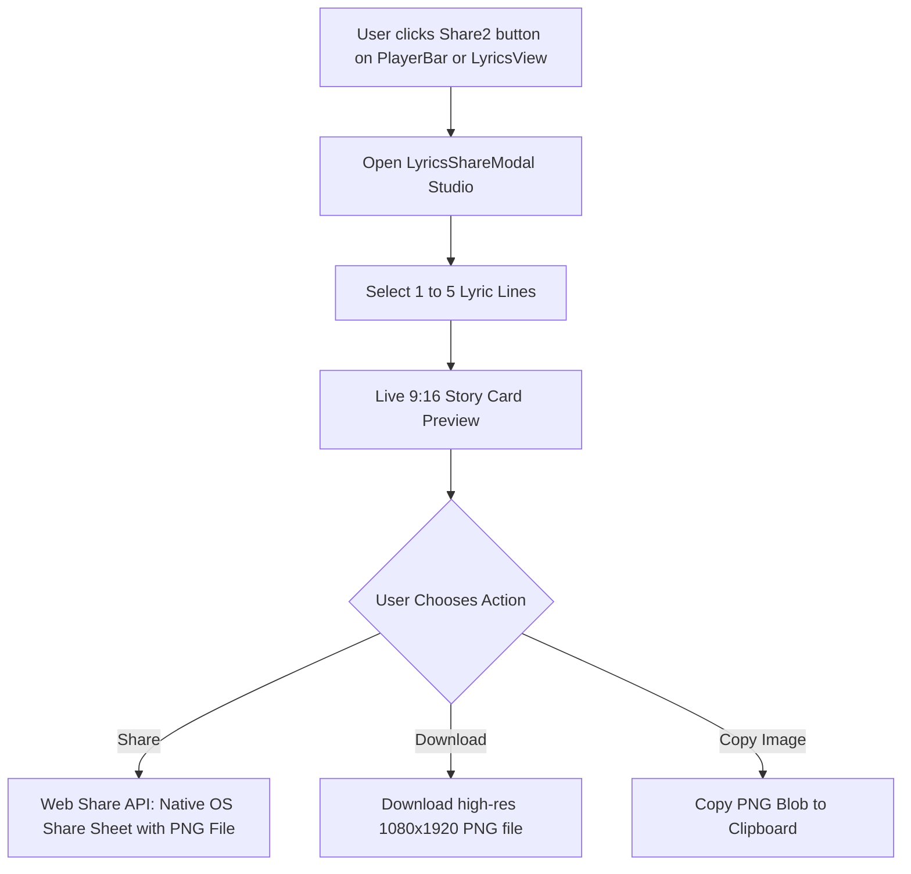

# Spotify-Style Lyrics Sharing Feature Design

**Date:** 2026-08-14  
**Status:** Approved  
**Topic:** Spotify-Style Lyrics Sharing (9:16 Story Card Generator & Web Share API)

---

## 1. Overview & Goal

Build an authentic Spotify-style **Lyrics Sharing** experience for MusicWeb. Users can select between **1 and 5 lines of lyrics** from any currently playing track and generate a visually stunning **9:16 Story Card (1080 × 1920 px)** optimized for Instagram Stories, Facebook Stories, Zalo, and Messenger.

The feature supports:
- **Web Share API (`navigator.share`)** with file sharing capabilities for native mobile share sheets.
- **Direct High-Res PNG Download** for saving directly to photo libraries.
- **Copy Image to Clipboard** via `navigator.clipboard.write([new ClipboardItem(...)])`.
- Accessible directly from **PlayerBar** (in FullView/bar) and inside **LyricsView** header/controls.

---

## 2. User Experience & Interaction Flow

### 2.1 Entry Points
1. **PlayerBar (`components/player/PlayerBar.tsx`)**:
   - Add a `Share2` icon button next to favorite and lyrics buttons.
   - Visible on desktop and mobile full-view mode.
2. **LyricsView (`components/player/LyricsView.tsx`)**:
   - Add a `Share2` icon button in the top-right header action bar (beside the offset and refresh controls).
3. **NowPlayingOverlay (`components/player/NowPlayingOverlay.tsx`)**:
   - Integrated into the full-stage controls and bottom bar.

---

## 3. Detailed Component Architecture

### 3.1 `lib/lyricsShareCanvas.ts` (Canvas 2D Rendering Engine)
- Pure client-side Canvas 2D engine with zero external dependencies.
- **Output Dimensions:** 1080 × 1920 px (9:16 aspect ratio, high-DPI crisp rendering).
- **Visual Composition**:
  - **Background:** Multi-layer radial & linear gradient matching theme / album cover dominant color. Subtle backdrop blur effect if cover art is loaded.
  - **Header:** MusicWeb minimal branding tag with icon and sleek typography.
  - **Selected Lyrics Body:**
    - Up to 5 lines of text.
    - Dynamic font scaling (e.g. 56px - 72px font size depending on line count/character count) so long lines or multi-line selections fit proportionally without clipping.
    - Word-wrapping algorithm for long lines.
    - Bold, high-contrast white text with subtle text shadow.
  - **Footer Card:**
    - Rounded cover thumbnail (120x120px) with rounded corners and shadow.
    - Song Title (bold, truncated with ellipsis if too long).
    - Artist Name (medium weight).
- **Functions:**
  - `generateLyricCardBlob(options: LyricCardOptions): Promise<Blob>`
  - `generateLyricCardDataUrl(options: LyricCardOptions): Promise<string>`

### 3.2 Theme Presets
Provide 5 curated aesthetic themes:
1. **Dominant Glow (Default):** Extracted from album cover or primary cyan glow `(#06b6d4, #0f172a, #07090e)`.
2. **Midnight Obsidian:** Deep dark velvet with subtle violet accents `(#4c1d95, #1e1b4b, #030712)`.
3. **Cyberpunk Neon:** Electric cyan & vivid magenta `(#06b6d4, #ec4899, #090d16)`.
4. **Sunset Horizon:** Warm amber & rose gradient `(#f59e0b, #e11d48, #180914)`.
5. **Emerald Beats:** Iconic Spotify deep emerald & mint `(#10b981, #064e3b, #051611)`.

### 3.3 `components/player/LyricsShareModal.tsx`
- **Left Column / Top Section (Line Selection)**:
  - Scrollable list of lines from `parsedLyrics`.
  - Checkbox / highlight state for each line.
  - Validation: Min 1 line, Max 5 lines.
  - Counter badge: e.g. `Đã chọn: 3/5 câu`.
  - Toast notification or subtle disable if user tries to pick > 5 lines.
- **Right Column / Bottom Section (Card Preview & Actions)**:
  - Responsive visual preview scaled to fit container (e.g. 360x640 preview of 1080x1920 canvas).
  - Theme selector pills/dots.
  - Action buttons:
    - **Chia sẻ ngay (`Share2`)**: invokes Web Share API if `navigator.canShare({ files: [file] })` or fallback.
    - **Tải ảnh PNG (`Download`)**: triggers direct browser download `musicweb-${title}-lyric.png`.
    - **Sao chép ảnh (`Copy`)**: writes PNG blob to clipboard.

---

## 4. Error Handling & Edge Cases
- **Tracks without lyrics:** Share button shows a clean empty state or disabled notice *"Bài hát chưa có lời để chia sẻ"*.
- **Plain (unsynced) lyrics vs Synced lyrics:** Both work seamlessly since line selection works on lines regardless of timestamps.
- **Cross-origin cover images in Canvas:** Use `crossOrigin = 'anonymous'` on `new Image()` and fallback to a stylized music note icon if CORS blocks the external image.
- **Mobile Web Share rejection (User cancels share sheet):** Catch `AbortError` silently without showing error toasts.

---

## 5. Verification & Testing Plan
- **Unit Tests (`lib/__tests__/lyricsShareCanvas.test.ts`)**:
  - Test line wrapping and text scaling calculations.
  - Test max 5 lines constraints and canvas dimension parameters.
- **Manual Verification**:
  - Test opening modal from PlayerBar and LyricsView.
  - Test selecting 1, 3, and 5 lines.
  - Test all 5 color themes.
  - Test PNG download, copy to clipboard, and Web Share API.
